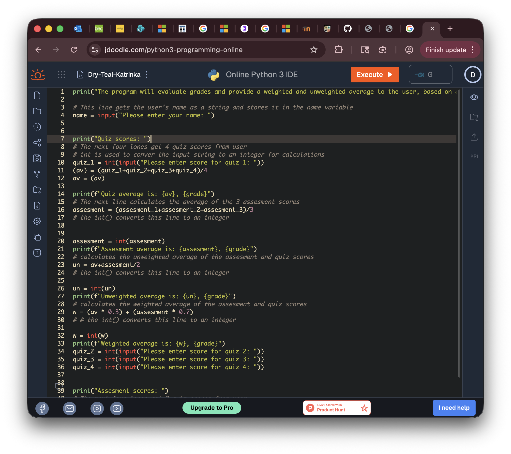

# Desta Melaku's Portfolio
Portfolio for Desta
# Desta Melaku
Contact Info: destamelaku0@gmail.coms
### About Me 
Hello! I am currently an undergraduate student at Loyola University of Maryland majoring in Sociology.  

 

With skills in communication, data analysis, and research, I am able to apply my skills of analysis and knowledge of different backgrounds and to achieve accurate assessments of a variety of situations. I am adept at using Microsoft 365, Python, SPSS, Ecosystem, and Excel.  

 

My growing skill set, commitment to my work, and passion for improvement as valuable assets.  In my spare time, I like to draw and crochet.  
 
You can find me on linkedin @ Desta Melaku. 

 

### Education
Loyola University Maryland, Sociology B.A.
***
### Projects

#### Inventory Manager 
 - Summary
 - 
 - Project 1 Report
***
#### Dashboard 
 - Project 2 Summary
 - 
 - Project 2 Report
***
#### Python
 - Project 3 Summary
 - 
 - Project 3 Report
