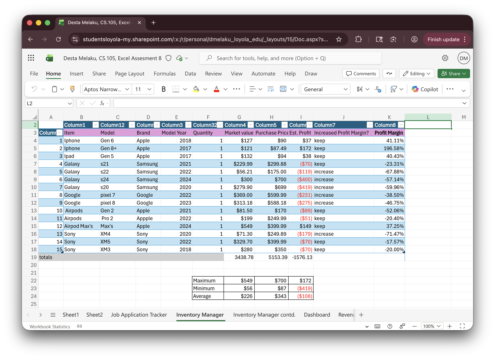

# Desta Melaku's Portfolio
Portfolio for Desta
![profile]
# Desta Melaku
Contact Info: destamelaku0@gmail.coms
### About Me 
Hello! I am currently an undergraduate student at Loyola University of Maryland majoring in Sociology.  

 

With skills in communication, data analysis, and research, I am able to apply my skills of analysis and knowledge of different backgrounds and to achieve accurate assessments of a variety of situations. I am adept at using Microsoft 365, Python, SPSS, Ecosystem, and Excel.  

 

My growing skill set, commitment to my work, and passion for improvement as valuable assets.  In my spare time, I like to draw and crochet.  
 
You can find me on linkedin @ Desta Melaku. 

 

### Education
Loyola University Maryland, Sociology B.A.
***
### Projects

#### Inventory Manager 
 - Summary
 - 
 - Project 1 Report
***
#### Business Dashboard 
 - Initial Project Idea: The goal of this project was to use formulas I had used in the past and present and learn how to pull data from other tables. I wanted to practice old and new techniques.
 - 
 - Tools I used: Microsoft Excel
 - Challenges: I struggled with taking data from other tables to link on this table due especially when it comes to making sure the formulas were correct. I evantually got help and was able to find out how to copy and paste them in. 
 - Result: I successfully got all the formulas to work but in the future I would try to make them more exact and add new ones that show more detail. 
 - Summary: In this project I had to add the total number of items, inventory cost, total potential revenue, average profit margin, and item with the highest profit margin. By pulling data from the inventory manager sheet. 
***
#### Python
 - Initial Project Idea: I needed to make a grade evalutator that calculated averages (weighted and unweighted). I wanted a way to calculate my grade that I could easily update and save.
 - 
 - Tools I used: Python language on Jdoodle
 - Challenges: I struggled with organizing the code and using the right symbols. Doing the code to calculate the weighted average was also difficult to organize since I had never done math on code before. 
 - Results: I was able to get the averages and easily put in data as well. In the future I would like to make it more complicated and involve assignments into the total. 
 -  Summary: This project is a grade evaluator that takes into account the weight of quizzes and assesments according to user input. After entering the scores for each quiz and assesment. In the third section the average of all quizzes, all assesments, as well as a weighted and unweighted average are produced. 
